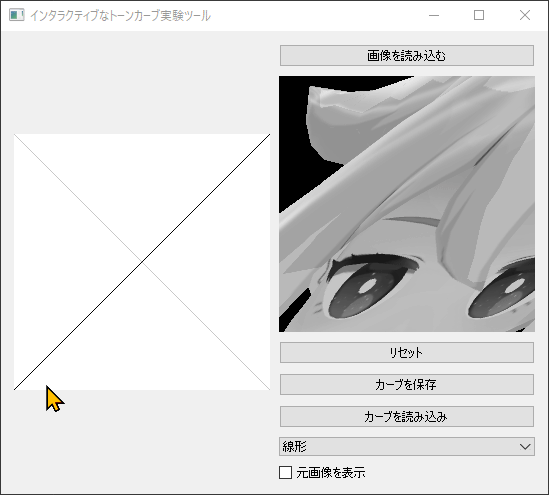

# interactive_tonecurve



```
pip install PyQt5 opencv-python numpy
```


Initial prompt:

Pythonで次のようなプログラムを作成してください。

■タイトル
インタラクティブなトーンカーブ実験ツール

■概要
このツールでは、左側にトーンカーブ、右側にユーザーによる入力画像に対してトーンカーブによる濃淡変換処理を施した画像が表示されています。そして、ユーザーはトーンカ－ブをマウスのクリック・ドラッグによって自由に描画することができ、トーンカーブが変更されると即座に画像に濃淡変換処理が反映されるため、ユーザーはトーンカーブの形状によって画像の濃淡がどのように変化するか実験的に確かめることができます。


■入力画像
・サイズ：任意
・拡張子：JPG, PNG, BMP
・カラー、または、白黒の画像

■トーンカーブ
・0～255の諧調変換
・正方形のグラフ
・斜め45度の目立たない色の実線
・斜めマイナス45度の目立たない色の点線
・初期値はガンマ補正を行うカーブ（これの意味が分からなければ任意の曲線で設定してください。）

■注意点
・入力画像がカラーで与えられることもありますが、変換結果は白黒で表示してください。
・トーンカーブのリセットボタンを搭載
・トーンカーブを一般的に使用されるカーブ（折れ線を含む）に設定するためのドロップダウンリストを搭載
・トーンカーブの編集に対する画像表示のレスポンスがリアルタイムでストレスがないこと
